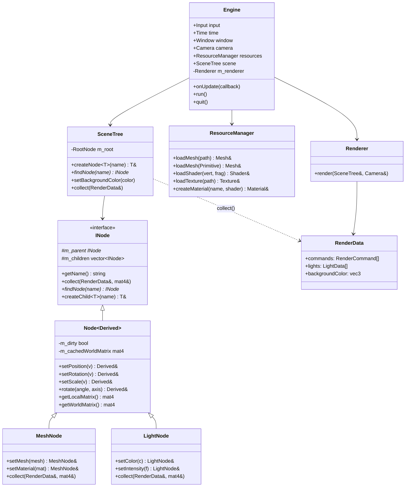

# Sylph — A C++ OpenGL Framework

A lightweight C++ framework built on top of OpenGL that abstracts away the boilerplate and lets you focus on building 3D scenes. Built as a learning project while working through OpenGL fundamentals, with a strong focus on clean architecture, developer experience, and performance.

---

## At a Glance

- **Scene graph** with a node hierarchy, transform propagation, and dirty-flag caching
- **Fluent, chainable API** across nodes, materials, and resource loading
- **Resource management** with deduplication — meshes, shaders, textures, and materials are loaded once and referenced
- **Batched rendering** — draw calls sorted by material to minimize shader/state switches
- **Memory safety** — strict ownership via `unique_ptr`, RAII, and explicitly deleted copy constructors throughout
- **Built-in FPS camera** with mouse look and keyboard movement out of the box

---

## Quick Example

A navigable 3D scene with hierarchical transforms, lighting, and textures in ~50 lines:

```cpp
#include "Sylph.h"

int main() {
  Engine engine("Solar System");

  engine.scene.setBackgroundColor({0.0f, 0.0f, 0.0f});
  engine.camera.setPosition({0.0f, 0.0f, 0.0f});

  // Resources
  Mesh &sphereMesh = engine.resources.loadMesh(Primitive::Sphere);
  Shader &litShader = engine.resources.loadShader("assets/shaders/lit.vert", "assets/shaders/lit.frag");
  Shader &basicShader = engine.resources.loadShader( "assets/shaders/basic.vert", "assets/shaders/basic.frag");
  Texture &earthDiff = engine.resources.loadTexture("assets/textures/earth.jpg", false);
  Texture &earthSpec = engine.resources.loadTexture("assets/textures/earth_spec.jpg", false);

  // Materials
  Material &sunMat = engine.resources.createMaterial("sun", basicShader)
    .setColor({1.0f, 0.75f, 0.3f});

  Material &earthMat = engine.resources.createMaterial("earth", litShader)
    .setDiffuseTexture(earthDiff)
    .setSpecularTexture(earthSpec)
    .setShininess(80.0f);

  // Scene
  MeshNode &sun = engine.scene.createNode<MeshNode>("sun")
    .setMesh(sphereMesh)
    .setMaterial(sunMat)
    .setScale({3.0f, 3.0f, 3.0f})
    .setPosition({0.0f, 0.0f, -5.0f});

  sun.createChild<LightNode>("sunLight")
    .setIntensity(4.5f)
    .setColor({1.0f, 0.72f, 0.4f});

  MeshNode &earth = sun.createChild<MeshNode>("earth")
    .setMesh(sphereMesh)
    .setMaterial(earthMat)
    .setPosition({3.0f, 0.0f, 0.0f});

  // Loop
  engine.onUpdate([&]() {
    if (engine.input.isKeyJustPressed(Key::Escape)) 
      engine.quit();

    float dt = engine.time.getDeltaTime();
    sun.rotate(dt * 5.0f, {0.0f, 1.0f, 0.0f});
    earth.rotate(dt * 60.0f, {0.0f, 1.0f, 0.0f});
  });

  engine.run();
}
```

---

## Architecture

`Engine` acts as the central hub, owning all the subsystems and wiring them together. The user interacts with public members directly — no getters, no service locator.



### Scene Graph & Transform Caching

Nodes form a tree. Each node stores its local transform (position, rotation, scale) and derives its world matrix by concatenating up the hierarchy. World matrices are computed lazily and cached — a `markDirty()` call propagates downward through children whenever a transform changes, so nothing is recomputed unless it needs to be.

```cpp
// Changing a parent transform automatically invalidates children
parent.setPosition({1.0f, 0.0f, 0.0f}); // marks parent + all descendants dirty
```

Camera uses the same pattern: the view matrix is only rebuilt when the camera actually moves or rotates.

### Rendering Pipeline

Each frame, `SceneTree::collect()` does a depth-first traversal and populates a `RenderData` struct — a plain data container holding draw commands, light entries, and the background color. The renderer receives this struct and knows nothing about the scene graph; it only consumes `RenderData`. This keeps the scene and rendering logic cleanly separated, and makes the pipeline easy to reason about.

The renderer then:

1. **Sorts commands by material pointer** to batch draw calls and avoid redundant shader switches
2. **Updates camera uniforms once per material change**, not per draw call

```cpp
std::sort(data.commands.begin(), data.commands.end(),
  [](const RenderCommand &a, const RenderCommand &b) {
    return a.material < b.material;
  });
```

### Resource Management

`ResourceManager` centrally owns GPU resources using `shared_ptr`s stored in hash maps keyed by path or resource name. Assets are loaded lazily and deduplicated automatically — requesting the same mesh, shader, or texture multiple times returns the same underlying resource, avoiding redundant GPU allocations and simplifying lifetime management across the engine.

---

## Project Structure

```
src/
├── Core.h                  # Single include for user code
├── engine/
│   ├── Engine              # Central hub
│   ├── Camera              # FPS camera with dirty-flag view matrix
│   ├── Input               # Keyboard/mouse state
│   ├── Time                # Delta time
│   ├── Window              # GLFW window wrapper
│   └── ResourceManager     # Deduplicated resource loading
├── renderer/
│   ├── Renderer            # Sorts + issues draw calls
│   ├── RenderData          # Frame data container (commands, lights)
│   ├── Shader / Material / Mesh / Texture
│   └── MeshFactory         # Procedural primitive generation
└── scene/
    ├── INode / Node        # Interface + CRTP base with transform caching
    ├── SceneTree           # Root container, drives collect()
    └── nodes/
        ├── MeshNode        # Submits a RenderCommand
        └── LightNode       # Submits a LightData entry
```

---

## Building

Requirements: CMake 3.16+, a C++20 compiler, OpenGL 3.3+ capable GPU.

**Quick build:**
```bash
# Linux / macOS
chmod +x build.sh && ./build.sh

# Windows
build.bat
```

**Manual build:**

```bash
cmake -B build
cmake --build build
```

---

## Dependencies

| Library   | Purpose         | How included              |
| --------- | --------------- | ------------------------- |
| OpenGL    | Graphics API    | System                    |
| GLFW 3.4  | Window & input  | System or FetchContent    |
| GLM       | Math            | Vendored (`third-party/`) |
| glad      | OpenGL loader   | Vendored (`third-party/`) |
| stb_image | Texture loading | Vendored (`third-party/`) |

---

## Status & Roadmap

This is a learning project, so I will be adding new features incrementally as I continue to explore OpenGL and real-time rendering architecture.

**Current state:** A functional forward-renderer with a scene graph, lighting, and textured materials.

**Planned next steps:**

- Shadow mapping
- Skybox support
- 3D model loading via Assimp
- Node lookup by ID — integer-keyed search as a more efficient alternative to name strings
